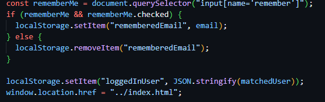

AI LOG

22.04.2026 20.26

- Promt: assets folder didn't show on the repository.
- Solved: Because the folders were empty and had no img or icons.

  24.04.2026 20.35

- Promt: WHy is there a white gap on the top and bottom of footer when I already set the background as the same color that I set on global.css?
- Solved: Because margin was defined, so it created gap for top and botton of footer

  24.04.2026 21.00

- Trouble shooting: had problem with responsive menu, the background didn't cover the whole screen when opened. They were opened separately.
- Solved: I had to set header.menu.open woth background-color: var(--primary-color) not just for nav ul.

  28.04.2026 21.16

- Promt: My active nav didn't work properly, am I doing it correctly?
- Solved: Mismatched in the script that prevents active marking: JS searches for a[data-link] but my nav links do not have data-link, and JS adds active to li, but my css style a.active.

  30.04.2026 22.34

- Promt: How do I handle remember me?
- Solved: If the box is checked, the email is saved to the localStorage.
  

  02.05.2026 22.26

- Promt: Why doesn't img from API shown?
- Solved: Removed fallback img abd rendering API img

  03.05.2026

- Promt: I have problem with responsive menu icons (cross and hamburger) when added header to new pages like cart, checkout and success, what could be the cause of this?
- Solved: src path that only works from the root, fixed by ../assets/icons... because the pages were in subfolders.

  15.05.2026 21:00

- Promt: Why isn't Product detail show after I logged out? It should be shown normally but the Add to Cart Button shouldn't be visible.
- Solved: The product is visible like how it should be, but I need to add function for loggedInUser for the add to cart button to be visible.
  
  
